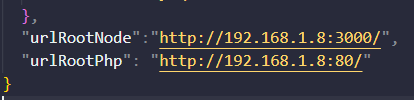
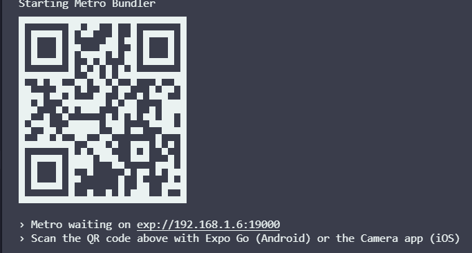
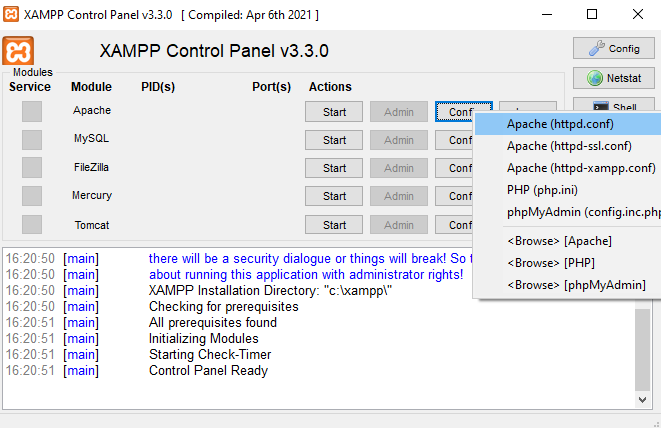
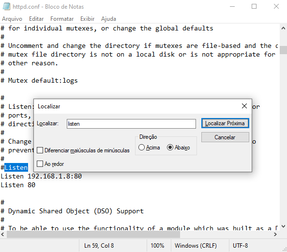

# PROJETO GASOLINA

# Como instalar o projeto

Primeiro passo, clone o repositorio, use o comando abaixo:

```
git clone --branch desenvolvimento https://github.com/Kalebeadv/gasolina-project.git
```

Segundo passo, instale o *expo* dentro do diretorio do projeto:

```
npm install expo-cli
```
> Obs: Voce precisa ter o node instalado, caso tenho alguma dúvida de como instalar o expo, [clique aqui.](https://docs.expo.dev/get-started/installation/)

Terceiro passo, instale todas as dependencias do projeto:

```
npm install 
```

Quarto passo, configure o banco de dados:

Para configurar o banco de dados é nescessário que você instale o software para gerencialo, recomendo o [XAMP](https://www.apachefriends.org/pt_br/index.html) ou o [WAMPSERVER](https://www.wampserver.com/en/download-wampserver-64bits/). Usaremos o MyPhpAdmin, crie um banco de dados dele com o nome "gasolina_project".

Agora que o banco de dados está criado, precisamos configurar a conexão com ele.

## Configurando a conexão com o banco de dados

Abra o arquivo *config.json*, que está na pasta *config/config.json* e modifique as duas linhas de código a seguir:



voce usará o mesmo IP para ambos, esse é o IP do *Expo* e para obtê-lo inicie a aplicacao com:

```
expo start
```
ou 

```
npm start
```
ou

```
yarn start
```
Após iniciar procure por *Metro waiting on exp://...*



pegue o IP disponibilizado pelo expo e cole no lugar dos IPs no *config.json*, porém, não modifique as portas.

Agora, configure o listener dentro do seu server do banco de dados. Com o XAMP, no módulo apache, clique em *config>Apache(httpd.config*



procure por *listen* e cole o IP do expo antecedido por *listen* dentro do *httpd.config*




## Rodando o banco de dados na aplicacao

Na pasta *valicadoresPHP* copie os dois arquivos *Controller.php*,*ClassDB.php* e cole na pasta *htdocs* dentro da raiz do XAMP.

Agora, na pasta do projeto, pelo *CMD* do windows, digite o seguinte comando:

```
npx sequelize-cli db:migrate
```

Abra um novo *CMD*, dentro da pasta do projeto, digite:

```
nodemon Controller.js
```

Por fim rode o projeto com um npm, yarn ou expo start.
