# DIAGRAMA DE CASOS DE USO 

{#caso-de-uso escala=0.35}

Fonte: Própria dos autores.

# DIAGRAMA DE ENTIDADE E RELACIONAMENTO - DER 

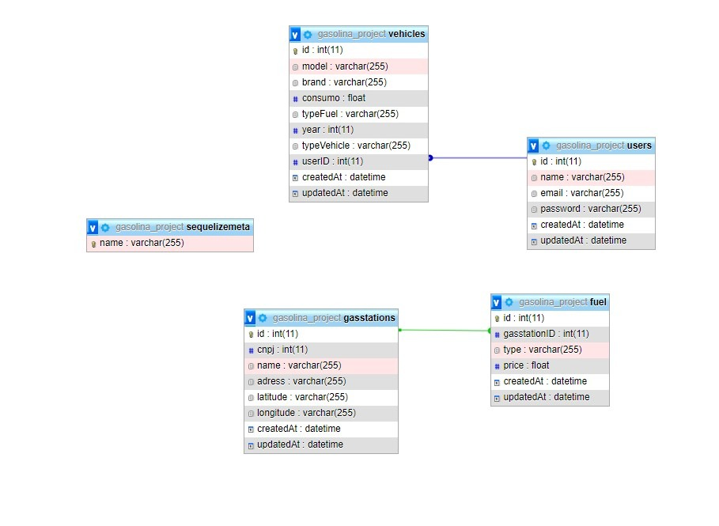{#der escala=0.5}

Fonte: Própria dos autores

# DICIONÁRIO DE DADOS 

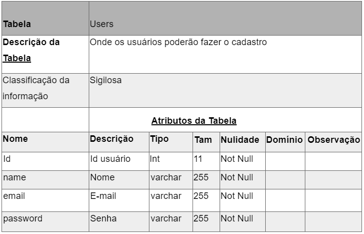{#bd01 escala=0.6}

Fonte: Própria dos autores.

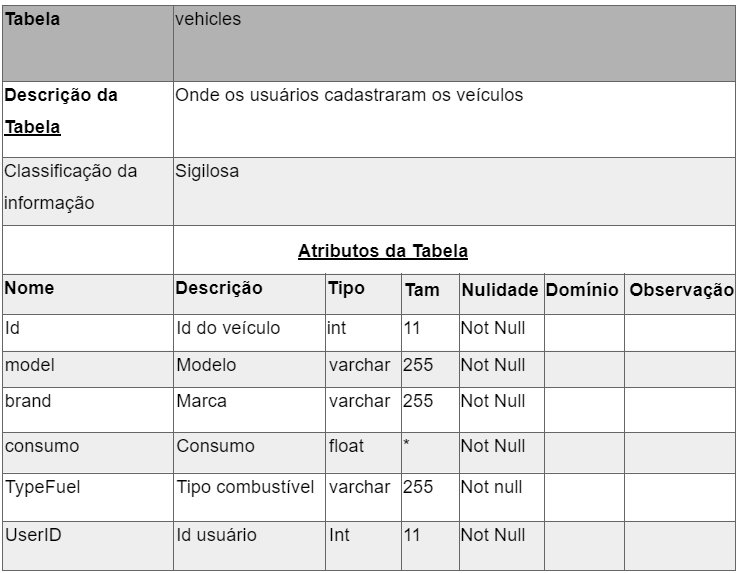{#bd1 escala=0.6}

Fonte: Própria dos autores.

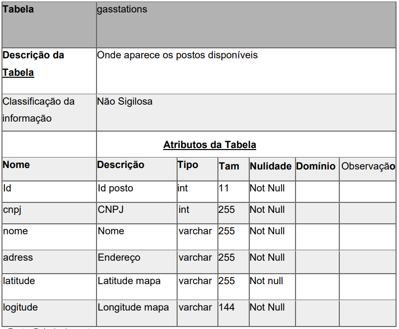{#bd2 escala=0.4}

Fonte: Própria dos autores.

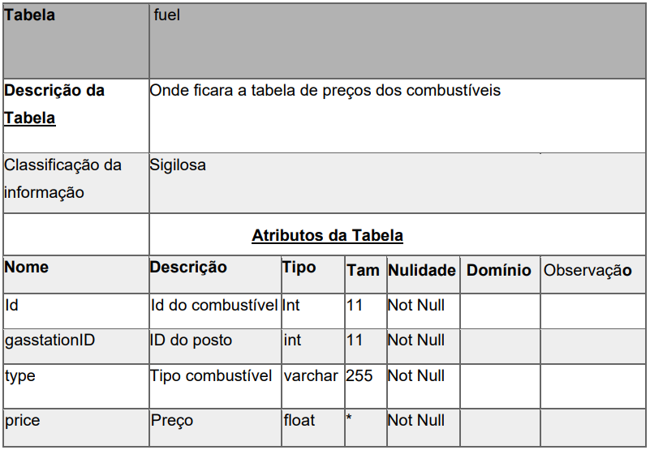{#bd3 escala=0.4}

Fonte: Própria dos autores.

# PROCESSOS DE NEGÓCIO - BPMN

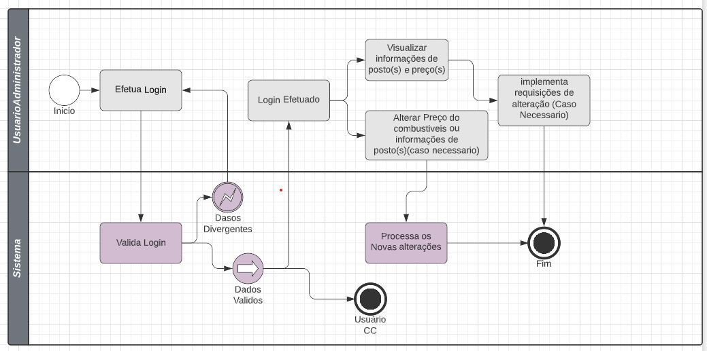{#bpmn1 escala=0.39}

Fonte: Própria dos autores.

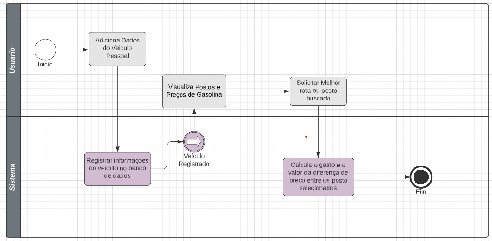{#bpmn2 escala=0.4}

Fonte: Própria dos autores.

# CANVAS DO PROJETO

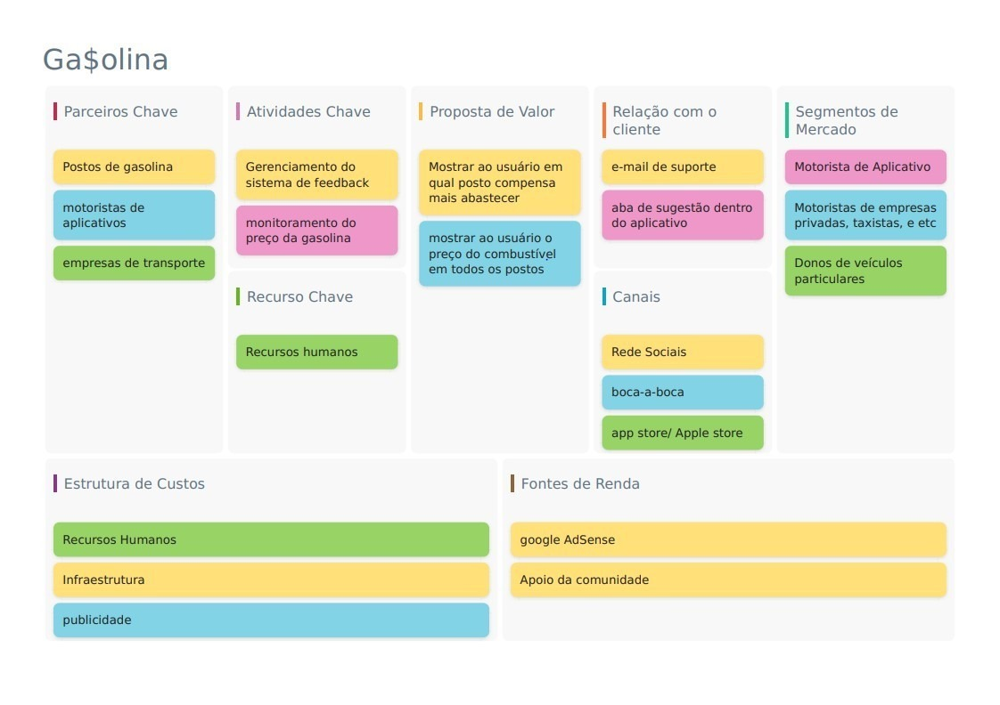{#canva escala=0.4}

Fonte: Própria dos autores.

# PLANO DE TESTE 

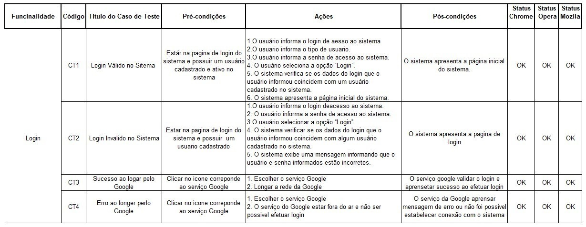{#teste1  escala=0.3}

Fonte: Própria dos autores.

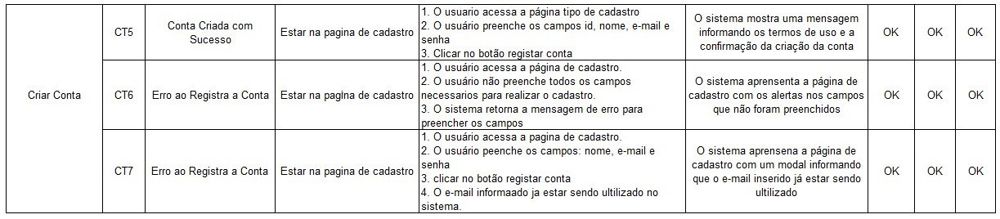{#teste2  escala=0.3}

Fonte: Própria dos autores.

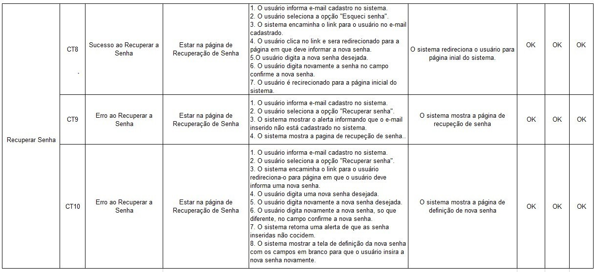{#teste2  escala=0.3}

Fonte: Própria dos autores.

{#teste3  escala=0.3}

Fonte: rópria dos autores.

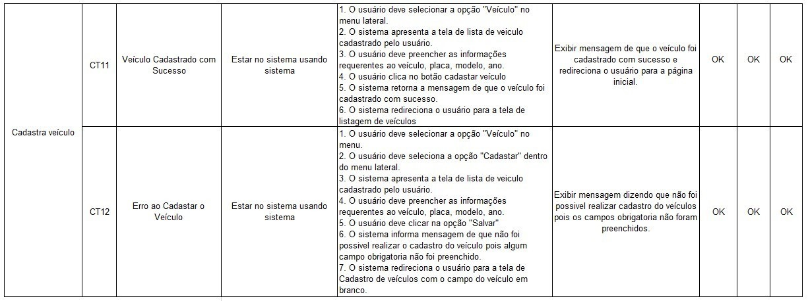{#teste4  escala=0.3}

Fonte: Própria dos autores.

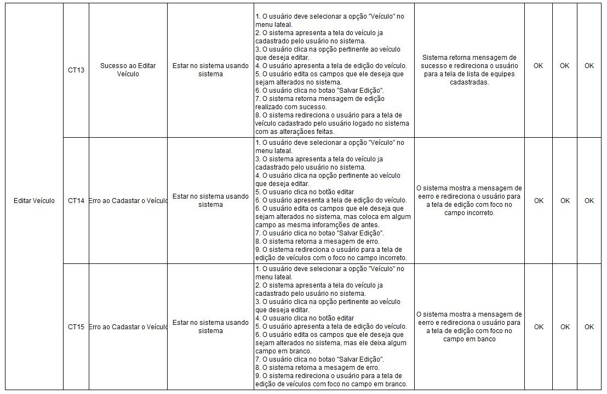{#teste5  escala=0.3}

Fonte: Própria dos autores.

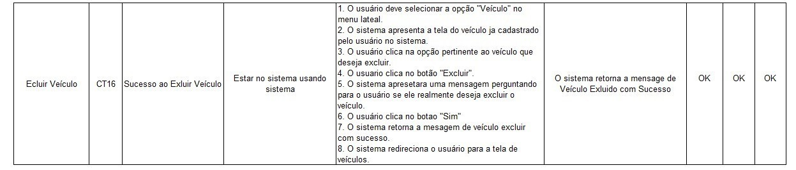{#teste6  escala=0.3}

Fonte: Própria dos autores.

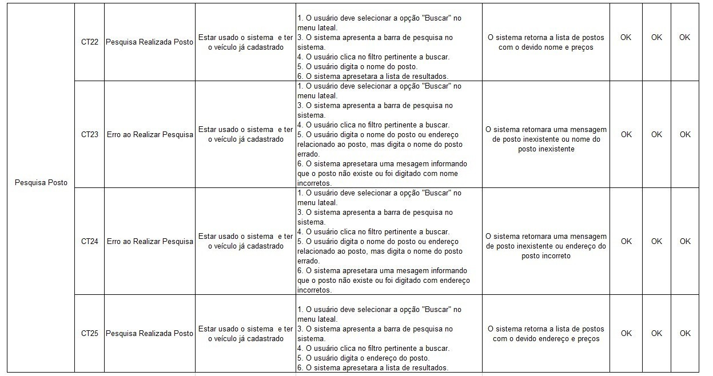{#teste7  escala=0.3}

Fonte: Própria dos autores.

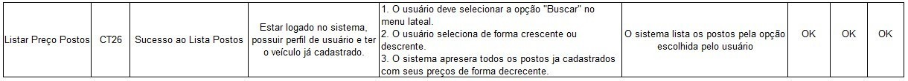{#teste8  escala=0.3}

Fonte: Própria dos autores.

