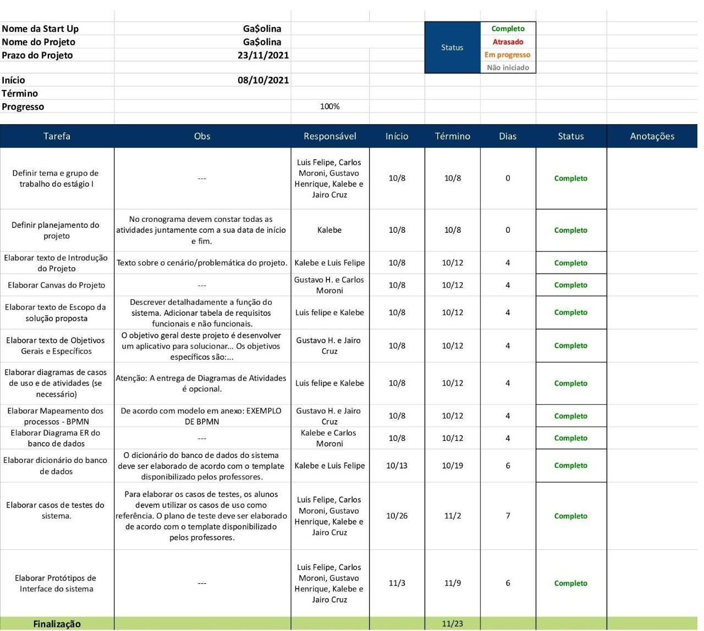

# Introdução
Atualmente, o Brasil enfrenta uma grande crise econômica, e uma das consequências dessa crise, está ligada ao preço do combustível, que apresenta grande instabilidade e aumentos expressivos. Para entender mais sobre o tema deste projeto, se faz necessário entender como é composto o preço dos combustíveis e como isso pode influenciar na vida dos brasileiros.

Em um mercado aberto, com preços concorrenciais (produto interno concorrendo com o produto importado), quando a produção interna de petróleo, gás ou derivados é inferior à demanda, tem-se um elo adicional, o do importador. O óleo cru nacional ou importado precisa chegar até uma refinaria em território nacional. No Brasil, 95% dessa produção é feita longe da costa, então, o petróleo costuma ser transportado em navios do ponto de produção até um terminal de armazenamento, antes de chegar a uma refinaria. A fração de petróleo ou derivado importado faz caminho semelhante, trazida de outros países por intermédio de um navio até um porto, onde ocorre a descarga e internalização do insumo. Após processados esses óleos nas refinarias, às distribuidoras recebem os derivados e dão capilaridade a eles, entregando os produtos nos milhares de pontos de venda espalhados pelo país.
Segundo F Delgado da Revista Conjuntura Econômica, “a flutuação de preços de todos os elos reflete, de modo geral, as cotações do petróleo. O petróleo é uma commodity cuja cotação internacional é referenciada ao petróleo Brent negociado na Bolsa de Londres, cotado em dólares por barril. Os petróleos brasileiros são referenciados no Brent, com valores levemente acima ou abaixo dele, dependendo da qualidade do óleo produzido em questão (vide Petróleo: qualidades físico-químicas, preços e mercados: o caso das correntes nacionais)”.
Aqui entra a primeira questão importante sobre o funcionamento da precificação desse mercado: diz respeito à variação dos preços dos combustíveis locais que dependem da cotação do petróleo e da taxa de câmbio, do valor da moeda local frente ao dólar. Quando há aumento do barril de petróleo ou aumento da taxa de câmbio (desvalorização da moeda), os preços dos combustíveis sobem, assim como eles caem quando essas duas variáveis flutuam no sentido oposto.

Conforme a pesquisa da Global Petrol Prices de 24/05/2021 a 14/06/2021, o preço final ao consumidor no Brasil estava abaixo da média mundial. Todos os países compram o petróleo nos mercados internacionais pelos mesmos preços, mas impõem diferentes impostos. Essa é a razão que explica porque o preço da gasolina no mercado varejista mundial apresenta discrepâncias. A Global Petrol Prices (2021) diz que, “o preço médio de venda da gasolina mundialmente foi US$1.18/litro, em 14/06/2021, correspondente ao valor de R$6,1018 no Brasil. O preço médio global da gasolina foi US$1.09 equivalente a R$5,886 em 24/05/2021. Os países mais ricos, exceto os EUA, apresentam preços mais altos, enquanto os mais pobres e os países produtores e exportadores de petróleo têm preços consideravelmente mais baixos.”

No Brasil, o preço dos combustíveis, nas refinarias e terminais nacionais é bem menor ao que é pago pelo consumidor final. Somente uma parte, cerca de 34% do preço da gasolina e 53% do preço do diesel, é da PETROBRAS. A gasolina produzida nas refinarias sai pura.

Os distribuidores acrescentam uma taxa em cima de cada categoria de combustível e ainda existe a carga tributária e outros custos da intermediação dos importadores, distribuidores, revendedores e produtores de biocombustíveis. Fatores sobre os quais a PETROBRAS não tem mais o controle, visto que está em vigor no Brasil o regime de liberdade de preços em todos os segmentos (produção, distribuição e revenda) do mercado de combustíveis e derivados de petróleo desde 2002. Isso significa que não há nenhuma categoria de tabelamento nem fixação de valores máximos e mínimos, ou qualquer exigência de autorização oficial prévia para reajustes. Nenhuma das mega empresas privadas reduziria o preço dos derivados produzidos frente a uma ociosidade ou excessos de ofertas localizadas. O que ocorre no mercado mundial do petróleo, quando o refino fica ocioso, por recessão ou por outros fatores (pandemia atual) é o fechamento de refinarias ou alienações como estão previstas no Brasil. Se os preços caem porque a demanda se reduz ou a oferta se amplia, os países que são grandes produtores e refinadores acertam quotas e buscam manter o preço, visto que, normalmente, os preços sempre são rígidos para baixo. Entretanto, o preço pago pelos consumidores brasileiros para a gasolina que sai da refinaria equipara-se aos preços internacionais, notadamente nos países cujos mercados de refinados são abertos à competição. Pequenas diferenças ocorrem em função do ambiente regulatório, estrutura tributária, eventuais subsídios governamentais, e da velocidade do repasse, automaticamente ou não, relativamente às variações dos preços internacionais do barril de petróleo e das variações cambiais refletidas nos preços internos. Frente ao aumento imparável do preço dos combustíveis, tentamos encontrar a melhor forma de facilitar a vida dos nossos usuários, infelizmente não podemos afetar a cadeia de produção para conseguir combustíveis mais baratos, então tivemos a ideia de criar um aplicativo que ajuda o usuário na busca por combustíveis mais baratos, desta forma gerando economia para o consumidor (inicialmente apenas em Rio Branco).

# Escopo da solução proposta

O escopo do projeto engloba o desenvolvimento de um aplicativo, denominada Ga$olina, cujo produto final é um aplicativo que ajuda o usuário na busca por um local com maior custo benefício para abastecer seu veículo, desta forma gerando economia para o consumidor. 
O aplicativo tem um funcionamento que se assemelha à experiência obtida com o Completai, Waze, GASNOL, CompletaAI, Gaso..
Nós escolhemos o Completai para falar mais detalhadamente, pois é o aplicativo que mais se assemelha ao nosso objetivo final. Para facilitar o entendimento acerca do Ga$, criamos uma lista de semelhanças e diferenças entre ele e o Completai.

1. Semelhanças
    - Tabelas de preço dos postos.
    -  Média de preço na região.
    -  Sistema para atualização de preços.
    - Interface intuitiva que possibilita ao usuário visualizar os preços do combustível.
    - Sistema para seleção do combustível específico.

2. Diferencas
    - O nosso aplicativo fará o cálculo da rota até o posto escolhido, fazendo uma comparação de custo, considerando o consumo do veículo que o usuário possui, a distância de ida e volta até o posto escolhido, e o preço do combustível praticado no posto de destino, com isso o usuário terá uma base mais precisa para decidir onde seria o local ideal para abastecer.

# Requisitos do sistema

\begin{quadro}[htb]
\ABNTEXfontereduzida{%
  \caption{Requisitos funcionais}
  \label{tab:71532}
}{%
  \begin{tabular}{|p{3.0cm}|p{11.0cm}|}
  \toprule
  Requisito & Descricao \\
  \toprule
  Adicionar veiculo & O usuário poderá adicionar quantos veiculos quiser seja moto ou carro  \\
  \midrule
  Cadastrar usuário & O usuário poderá se cadastrar inserindo apenas alguns dados obrigatórios para a conclusão do mesmo, como: nome, email, apelido e senha \\
  \midrule
  Calcular a rota para o posto escolhido & Calcular a distância, consumo do veículo e entregar o gasto que usuário terá até o posto escolhido \\
  \midrule
  Editar o perfil do usuário & As informações básicas do perfil de usuário poderão ser personalizadas \\
  \midrule
  Login pela conta do Google & O usuário poderá realizar cadastro usando a Google, sendo uma alternativa mais rápida de login \\
  \midrule
  Mostar rank & Mostra os 10 preços mais baixos dos postos da cidade \\
  \midrule
  Login normal & O usuário podera fazer login com um email normal  \\
  \midrule
  Mostrar o posto mais econômico &  Mostra o posto mais ecnômico com base no preco, distancia e consumo do veículo \\
  \midrule
  Manter os preços atualizados & Atualizar os preços do aplicativo baseado em tabelas \\
  \midrule
  Mostrar o preço do combustível & Mostrar  a o preço do combustível de todos os postos da cidade de Rio Branco \\
  \bottomrule
\end{tabular}%
}{%
  \fonte{Própria dos autores.}%\
}
\end{quadro}

\begin{quadro}[htb]
\ABNTEXfontereduzida{%
  \caption{Requisitos não funcionais.}%
  \label{tab:71532}
}{%
  \begin{tabular}{|p{5.0cm}|p{7.0cm}|}
  \toprule
  Requisito & Descricao \\
  \toprule
  Arquitetura do sistema & MVC  \\
  \midrule
  Compartilidade do sistema & Android \\
  \midrule
  Ferramentas para criação de código & Visual Studio Code \\
  \midrule
  Ferramentas para gerenciamento de atividades & Github e Android Studio \\
  \midrule
  Ferramentas de desenvolvimento & Android Studio e XAMPP \\
  \midrule
  Frameworks & Node.js, XAMPP e React \\
  \midrule
  Ferramenta para banco de dados & PhpMyAdmin \\
  \midrule
  Fluidez do sistema & Curto tempo de resposta \\
  \midrule
  Informações do usuário & Salva em nosso Banco de Dados \\
  \midrule
  Linguagem pra implementação do back-end & JavaScript \\
  \midrule
  O sistema deve usar os bancos de dados & MySQL, PHP \\
  \midrule
  Suporte de usuarios & Múltiplos usuários \\
  \midrule
  Tempo médio para carregar o sistema & 1 segundo \\
  \midrule
  Tempo médio para carregar o sistema &  1.5 segundo \\
  \bottomrule
\end{tabular}%
}{%
  \fonte{Própria dos autores.}%
}
\end{quadro}

# Cronograma do sistema

{#cronograma  escala=0.3 largura=150%}

Fonte: Própria dos autores.

Ver autoref{cronograma}

# Objetivos gerais e específicos

O objetivo deste projeto é criar um aplicativo para auxiliar os usuários a encontrar o melhor preço do combustível na sua região. Nossos objetivos específicos são: 
    - Mostra o preço do combustível na região de Rio Branco. 
    - Calcular a rota até o posto escolhido. Calcular o consumo do combustível do veículo até o posto escolhido. 
    - Auxiliar na decisão do usuário na hora de escolher onde abastecer. 
    - Buscar amenizar a “dor” de não conhecer o melhor local para abastecer os veículos.

<!--
Isto é um comentário, mesma sintaxe do HTML. Para conhecer a sintaxe
do limarka consulte: https://github.com/abntex/limarka/wiki/Sintaxe
-->

# Como utilizar recursos do limarka

**Consulte o wiki do projeto**: https://github.com/abntex/limarka/wiki

Cada capítulo inicia automaticamente em página ímpar (em conformidade com as Normas). Por isso que existem várias páginas em branco nesse documento.

## Como citar e referenciar

O arquivo de referências é configurado em "configuracao.pdf", utilize-o
para gerenciar suas referências.

Veja um exemplo de citação direta e referenciação a seguir:

> A ‘norma’ 6023:2000 (2) é complicada e cheia de inconsistências. Jamais será
possível gerar um estilo bibtex totalmente consistente com a ‘norma’, até porque
nem a ‘norma’ é compatível com ela mesma. Um bom estilo bibliográfico deve
ter uma linha lógica para formatação de referências. Assim, com alguns poucos
exemplos, qualquer pessoa poderia deduzir os casos omissos. Nesse sentido, a
‘norma’ 6023 trafega pela contra-mão. É quase impossível deduzir sua linha lógica.
O problema mais grave, no entanto, fica pela maneira de organizar nomes. A ABNT
quebrou o sobrenome em duas partes. Normalmente se fala apenas em “*last name*”,
mas agora temos o “*last last name*” graças à ABNT. \cite[p. 5]{abntex2cite}.

Consulte o documento \citeonline{abntex2cite} para conhecer como referenciar os
conteúdos.

## Como inserir imagens

Por exemplo, a Figura \ref{passaro} mostra um pássaro que possui as cores da bandeira do Brasil.

<!--
Para referenciar essa figura no texto utilize: Figura \ref{passaro} ou \autoref{passaro}
-->

{#passaro escala=0.4}

Fonte: \citeonline{limarka}

As imagens são inseridas o mais próximo possível do texto que as referenciam.

# R

## Como inserir imagens do R

A Figura \ref{histograma} é um histograma.

{#histograma escala=0.4}

Fonte: Autor.

Para gerar os códigos R, digite `rake r` no terminal. Isso irá compilar todas os códigos dentro da pasta imagens, com extensão `.R` para `.pdf`, em seguida poderá incluir normalmente como uma imagem.

**NOTA**: Certifique-se de ter instalado todos os pacotes R necessários para compilar sua imagem.

Também é recomendado a utilização do `guard` para geração automática quando houver alterações.

{#pizza escala=0.4}

Fonte: Autor.

# Dois gráficos R juntos

{#doisgraficos escala=0.4}

Fonte: Autora.

## Tabelas

Configurações de figura

|configuração|descrição|
|---|---|
|fig.align|	Alinhamento de graficos e figura no documento final: 'left', 'right', or 'center'|
|out.height   out.width	|Escala de fargura e altura da figura no documento final. Pode ser "%", "px", "cm"|
